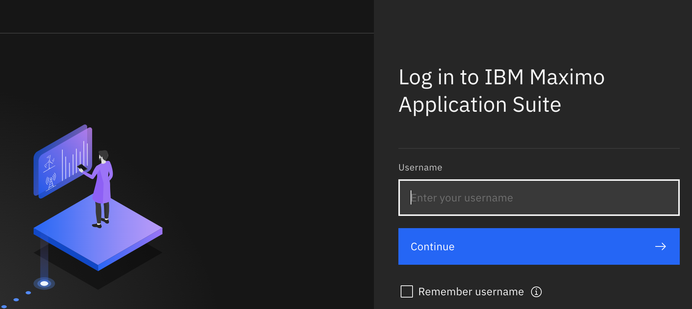
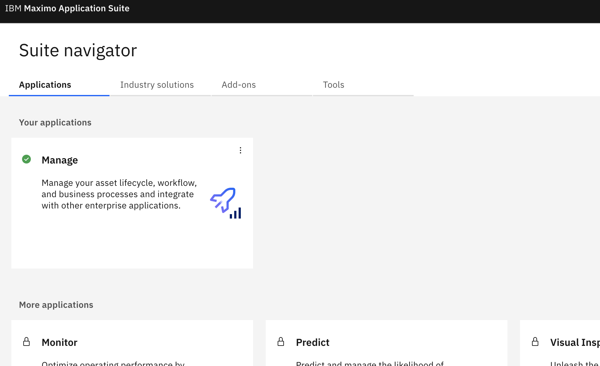
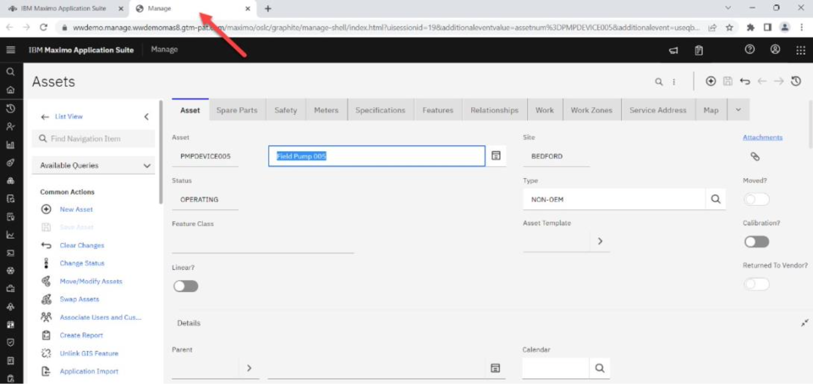
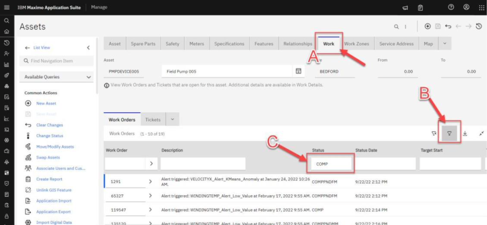

# Maximo Application Suite

In this lab you will get a tour of how Asset application within Maximo Manage to setup and work with Assets.

## Lab Story Line

A Water Resource Authority (WRA) is setting a new plant and wants to configure the assets used for wastewater treatment.

## Lab Script

### Step 1: Log into the Maximo Application Manage

To complete this step, get the credentials for the lab from the `lab prereqs` section.

**Actions:**

1. Click on this [Maximo Application Suite Lab Environment](https://masdev.home.mas-siemens.buildlab.cloud/) URL link to launch IBM Maximo Application Suite and bring up the login page.

2. The **IBM Maximo Application Suite** login page opens in a web browser.

   - Enter the Maximo Manage `Username` found in lab credentials page and click on `Continue`. Enter the  `Password`  and click `Log in`.

   
    
   Once the login credentials are accepted, the `Maximo Application Suite navigator` window opens. Several applications that make up the MAS products are displayed. In this demo, the focus will be on Maximo Manage. Click the `Manage` application tile.

   

4. You have reached the Manage landing page.

   

5. 
### Step 3: Review Asset Work order history

Next, the Operations Manager wants to look at this pump's maintenance history to see if there were any recent services done on it that could be the cause of the current problem.

18. On the **Asset Information** card on this dashboard (bottom right), click on the **PMPDEVICE005** hyperlink under the **Asset_ID** column to open Maximo Manage. 🟢

    

19. The Maximo **Manage** window opens in a separate browser tab.

    

20. Select the **Work** tab **(A)** and then click on the filter icon (funnel) to see the available filter options **(B)**.
21. Type **“COMP”** in the **Status** box in the **Work Order** section to filter recent completed work orders for this pump **(C)**. Press **Return** on the keyboard to apply the filter.

    

22. This is where the Operations Manager can review previously completed work orders to make informed decisions on how to proceed with any maintenance. Let’s assume they did not see any recent work orders that seem relevant.

23. The Operations Manager is convinced a new Service Request needs to be opened for investigation. Close the **Manage** browser tab **(A)**.

24. Return to the **Monitor** browser tab (where you started this demo) to view the **PMPDEVICE005** dashboard in Maximo Monitor **(B)**.

## Closing Remarks

This end-to-end demonstration has shown how an Operations Manager can use AI anomaly detection to monitor all of their enterprise's pumps in near-real time, eliminating false positive alerts. This persona was able to investigate an asset in trouble and submit a service request all by using Maximo Monitor and Maximo Manage.

This demo has also shown how enterprises can detect the current and predicted future conditions of thousands of assets at scale using Maximo Manage and Predict, thus ensuring that operational teams aren't over- or under-maintaining assets. As users address the assets in a work queue, they can provide their organizations tremendous value by reducing downtime, saving on maintenance and operational costs, and increasing revenue.
