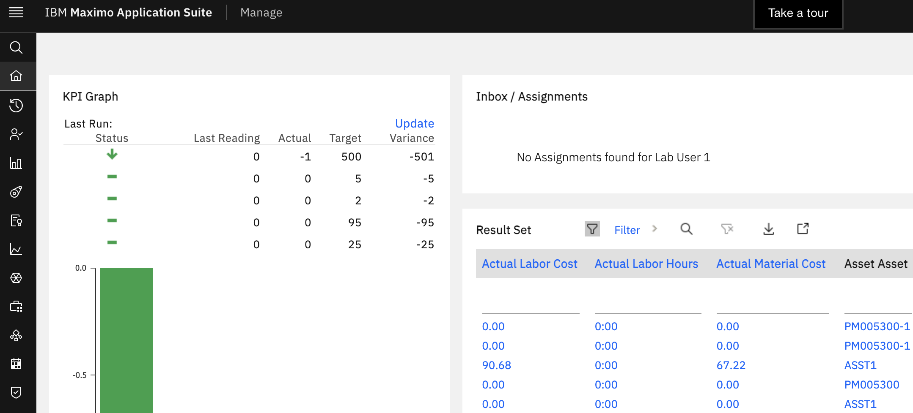
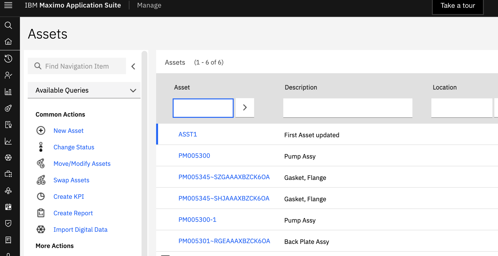
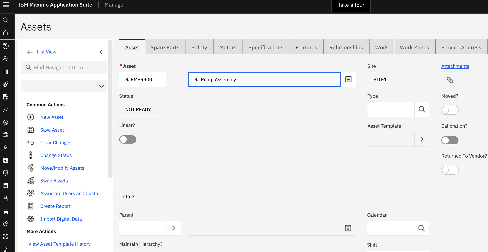
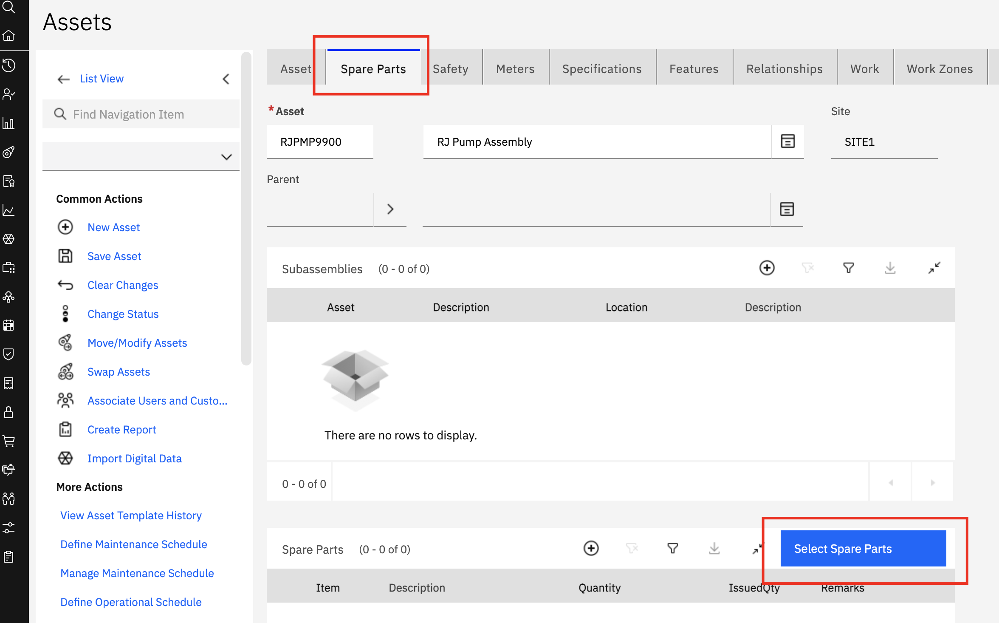
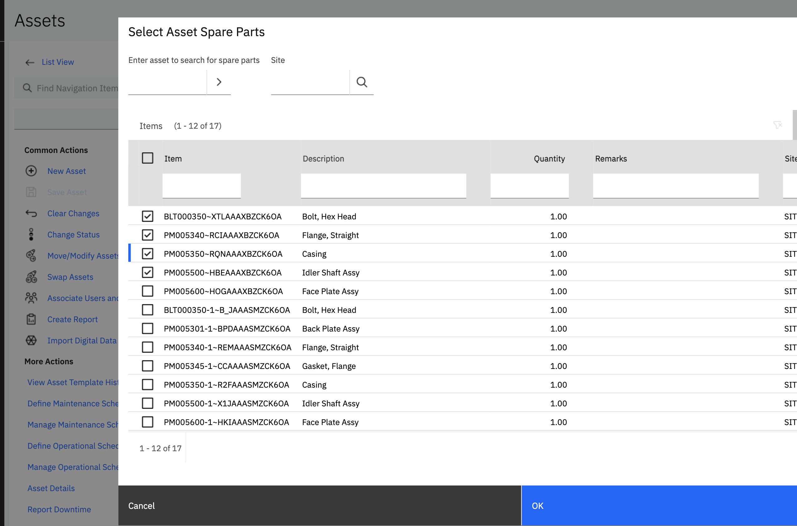
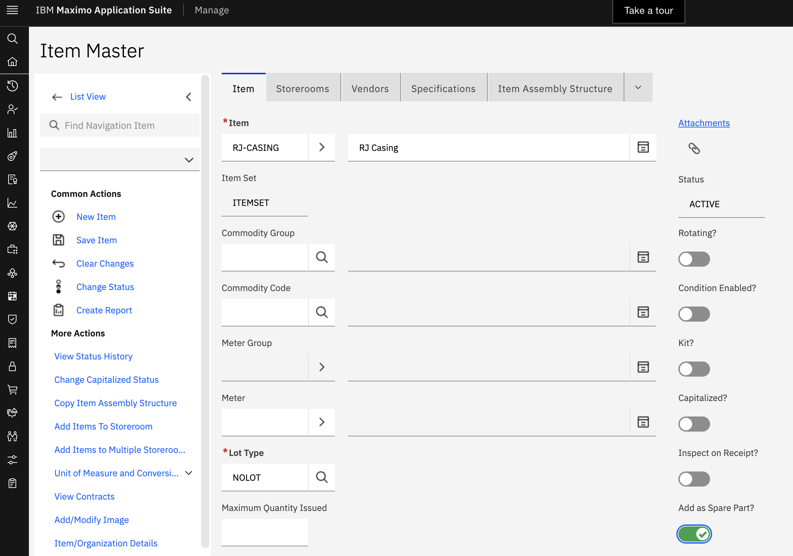

# Maximo Application Suite

In this lab you will get a tour of how Asset application within Maximo Manage to setup and work with Assets.

## Lab Story Line

A Water Resource Authority (WRA) is setting a new plant and wants to configure the assets used for wastewater treatment.
This lab walks you through the steps an Asset Manager will take to create a pump assembly manually in the system.

## Lab Script

### Step 1: Log into the Maximo Application Manage

To complete this step, get the credentials for the lab from the `1. Lab Prerequisites` section.

**Actions:**

1. Click on this [Maximo Application Suite Lab Environment](https://masdev.home.mas-siemens.buildlab.cloud/) URL link to launch IBM Maximo Application Suite and bring up the login page.

2. The `IBM Maximo Application Suite` login page opens in a web browser.

   - Enter the Maximo Manage `Username` found in lab credentials page and click on `Continue`. Enter the  `Password`  and click `Log in`.

   
    
   Once the login credentials are accepted, the `Maximo Application Suite navigator` window opens. Several applications that make up the MAS products are displayed. In this demo, the focus will be on Maximo Manage. Click the `Manage` application tile to launch the Manage application.

   

4. You have reached the Manage landing page. The landing page can be configured with portlets to provide quick access and information summary as a dashboard.

   

### Step 2: Create an asset

Next, the Asset Manager wants to create a new asset record for a pump assembly.

5. Form the left navigation menu, select `Assets > Asset`. Place the cursor in the first `Asset` filter box (highlighted in blue) and press the enter key. The list of assets available in the system will display as shown in the image below.

    

6. To create a new `Pump Assembly` asset needed by the Water Resource Authority, click on the `New Asset` link under **Common Actions** to create new asset. Enter the fields as described below.

    - Asset number: Number starting with you initial (eg: `RJ`PMP9900)
    - Description: `RJ` Pump Assembly
    - Site: SITE1

    

7. Select the `Spare Parts` tab and click on the `Select Spare Parts` buttons to view the list of available spare parts.

    

8. Select a few spare parts and click on the `OK` button to link those spare parts with the asset.

    

9. Click on `Floppy disk` icon at the top right to save the new asset.

### Step 3: Create a new spare part

10. Select the `Item Master` application from the list of applications by using the search bar called `Find Navigation item` in the left navigation bar. Click o the `New Item` under **Common Actions** to create a new Item Master. Enter the fields as described below.

    - Item number: Number starting with you initial (eg: `RJ`-CASING)
    - Description: `RJ` Casing
    - Add as a Spare part: true

    

    Click on the save icon to save the spare part.

## Closing Remarks

This exercise has shown how an Asset Manager can create a new asset, associate spare parts and other attributes with that asset record in Maximo Manage.

Performing asset initialization for green field deployments are labor intensive. Although there are data import tools available for Maximo, importing asset data directly from Teamcenter not only simplifies the data import process, it established the linkage with PLM.
