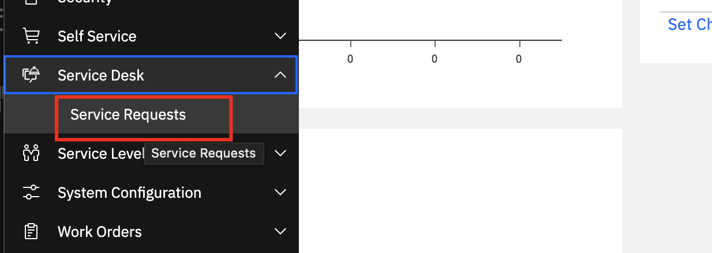
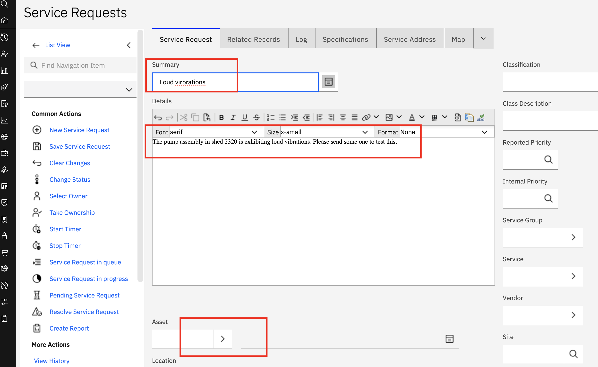
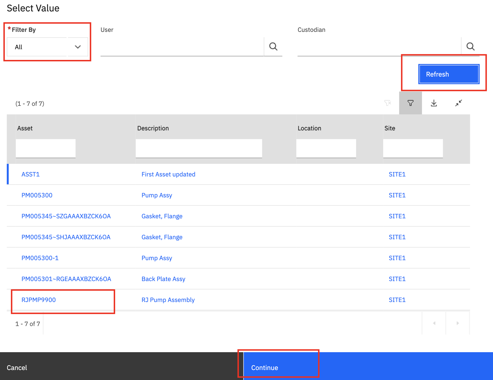
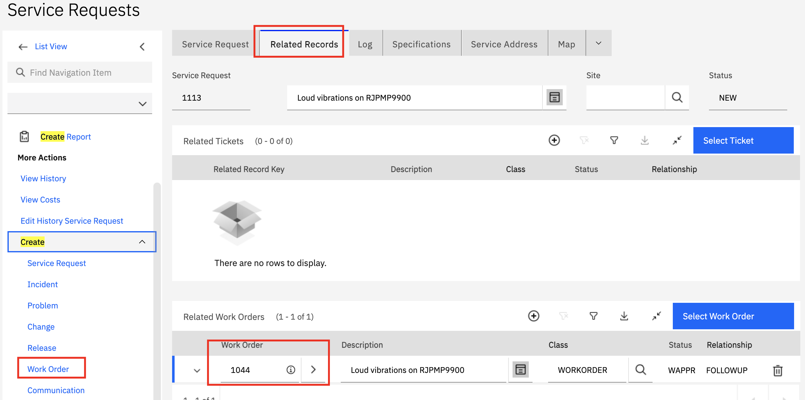
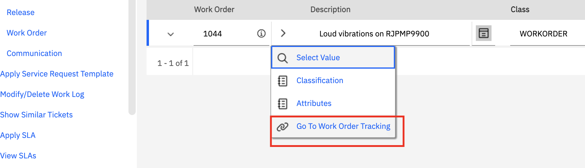
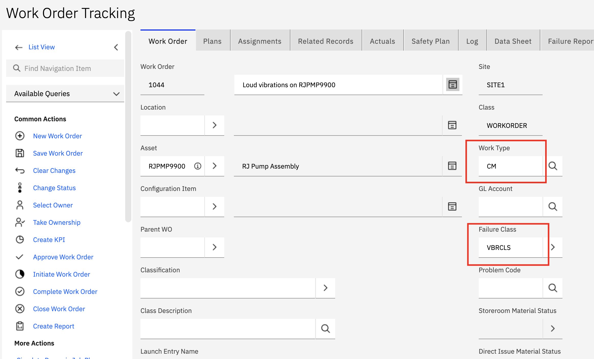
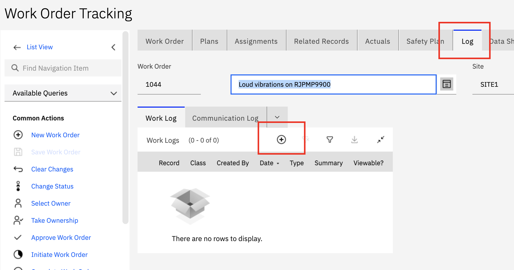
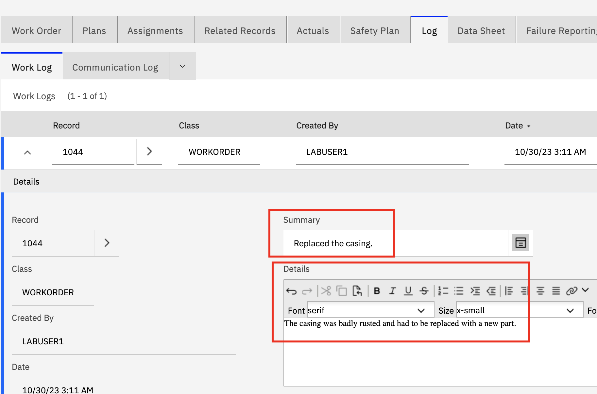

# Using Service Requests & Work Orders

In this lab you will get a tour of how create service request and work orders.

## Lab Story Line

Quality inspections happen at  Water Resource Authority (WRA) on a scheduled basis. For any signs of concern, a Quality Inspector would open a Service Request to bring the issue to Operation Manager's attention. The Operations Manager reviews the service request and determines if a Service Technician should be engagement or not. The Operations Manager creates a Work Order and assigns it to a technician. 

## Lab Script

### Step 1: Create Service Request

**Actions:**

1. Log into Maximo Manage as described in the previous lab. Select the `Service Request` application from the left navigation bar as shown in the picture.

    

2. Click on `New Service Request` to start creating the service request. Scroll down and enter the fields.

   - Summary: Loud vibrations
   - Description: Enter a suitable description

    

   - Click on the Asset `arrow` button to open up the asset selection panel. Select `All` from `Filter by` drop down and click on the `Refresh` button. Pick the asset `RJPM9900` that was created in the previous lab.

    

3. Save the service request by clicking the save icon at the top right corner.

### Step 2: Create a Work order from Service Request

The Operations Manager for this Water Resource Authority (WRA) receives the newly assigned service request. He reviews the request and creates a work order.

**Actions:**

4. Open the service request and click on the `Related Records` tab. Then click on `Work Order` under `More Actions > Create`. Note that a work order is created and linked to the service request.

   

5. Click the arrow button and select `GoTo Order tracking` to open the Work Order from the service request.

   

6. Review the open work order and select `Work Type` as `Corrective Maintenance`. Set the `Failure Class` to `VBRCLS`. Save the work order.

   

### Step 2: Create a Work order from Service Request

The Technician then reviews the work order and perform the corrective actions. He then updates the work order log with information about the work that was performed.

**Actions:**

7. Open the work order and click on the `Log` tab. Click on the `+` icon to start a new work log.

   

8. Enter the information about the repair and save the work order.

    

## Closing Remarks

This exercise has shown how an Inspector, Operations Manager and Technician can all work together to identify an issue and drive it to resolution using the service request and work order application in Maximo Manage.

